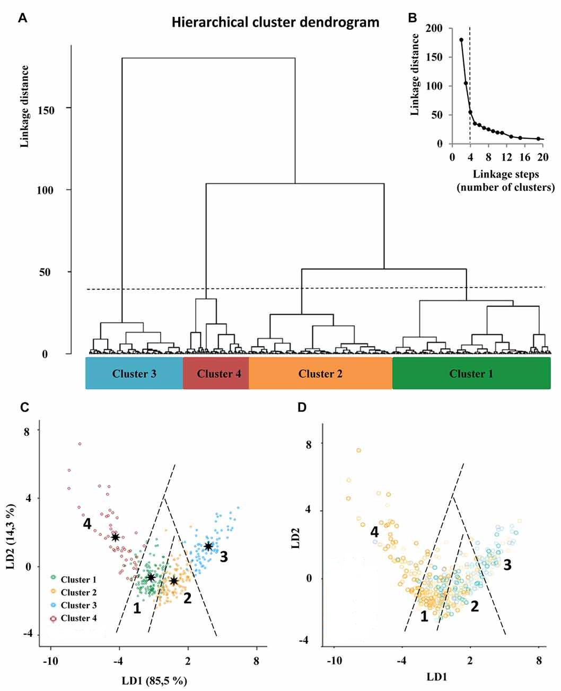

## Portfolio
---

### Skills

- Programming: R | Python | SAS | SPSS | Mplus
- Database: SQL (i.e. Postgresql) | AWS Redshift
- Data Visualization: Tableau | Looker
- Software & Tools: Git | Qualtrics | MS Office | LaTex

---

### Project

[Project 1 Title](/sample_page)

---
[Project 2: Customer Purchasing Behavior via Clustering Analysis](https://github.com/YajunMiaJia/Jia-Portfolio/blob/master/Project%202/hierarchical%20clustering%20analysis.Rmd)

---
[Project 3 Title](http://example.com/)

---

### Methodology & Script

- [Project 1 Title](http://example.com/)
- [Project 2: Unsupervised Machine Learning](https://github.com/YajunMiaJia/Jia-Portfolio/blob/master/Project%202/hierarchical%20clustering%20analysis.Rmd)
- [Project 3 Title](http://example.com/)
- [Project 4 Title](http://example.com/)
- [Project 5 Title](http://example.com/)

---

---
