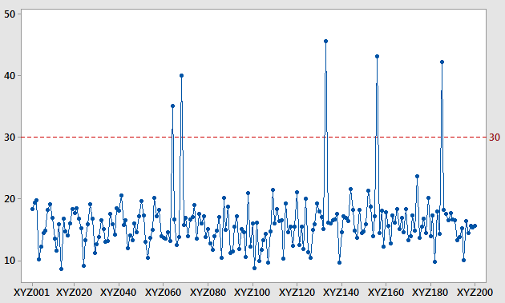
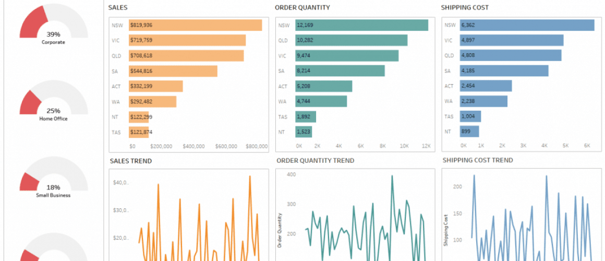

## Portfolio
---

### Skills

- Programming: R, Python, SAS, SPSS, Mplus
- Database: SQL (i.e. Postgresql), AWS Redshift
- Data Visualization: Tableau, Looker
- Software & Tools: Git, Qualtrics, MS Office, LaTex

---

### Project

[Project 1: Time Series Analysis for Predicting Milk Production](/Project 1/Time Series Analysis.pdf)

---
[Project 2: Customer Purchasing Behavior via Clustering Analysis](/Project 2/ClusteringAnalysis.pdf)

---
[Project 3: Imputating missing values & Weighting on under-representative variables]

---
[Project 4: Data Visualization using Tableau](https://public.tableau.com/profile/yajun.jia#!/vizhome/shared/JGPZK2FRQ)

---

### Methodology & Script

- [Project 1: Time Series Analysis for Predicting Milk Production](https://github.com/YajunMiaJia/Jia-Portfolio/blob/master/Project%201/TimeSeries.Rmd)
- [Project 2: Unsupervised Machine Learning](https://github.com/YajunMiaJia/Jia-Portfolio/blob/master/Project%202/hierarchical%20clustering%20analysis.Rmd)
- [Project 3: Imputation & Weighting]
- [Project 4: Data Visualization](https://public.tableau.com/profile/yajun.jia#!/vizhome/shared/JGPZK2FRQ)

---

---
